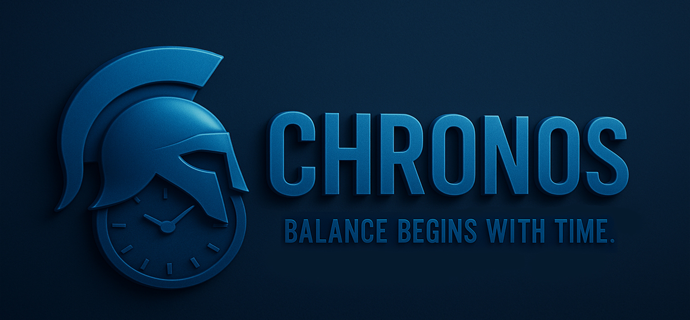
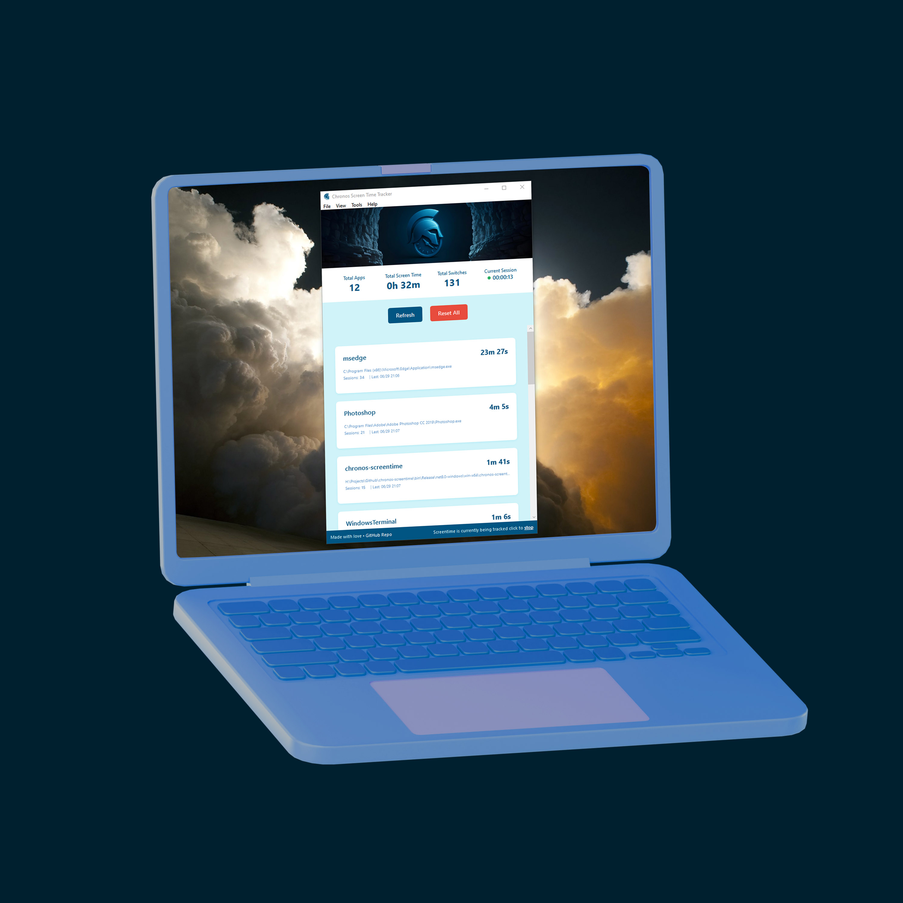

# Chronos Screen Time Tracker

<p align="center">
  <a href="https://opensource.org/licenses/MIT">
    
  </a>
  <a href="https://github.com/ghassanelgendy/chronos-screentime/issues">
    
  </a>
  <a href="https://github.com/ghassanelgendy/chronos-screentime/releases/tag/latest">
    
  </a>
</p>

<p align="center">
  <em>
          Chronos is also the 
    <a href="https://en.wikipedia.org/wiki/Chronos" target="_blank">
 Greek god of time!
    </a>
  </em>
</p>



**Chronos is a modern, open-source screen time tracking application for Windows. Built with .NET 8 and WPF, it provides a sleek and intuitive interface to help you monitor your application usage, understand your digital habits, and boost your productivity.**

---

## 🌟 Key Features

- **Real-Time Tracking:** Monitors your active application usage second-by-second.
- **Detailed Analytics:** Provides key metrics including total screen time per app, session counts, and total application switches.
- **Persistent Data:** Automatically saves your tracking data locally, so your history is always available.
- **Modern UI:** A clean, responsive, and visually appealing interface built with WPF.
- **Start/Stop Control:** Easily start and stop tracking at any time directly from the main window.
- **Data Management:** Reset all tracking data or clear the history for a specific application.
- **Window Controls:** Includes handy options like "Always on Top" and the ability to hide the title bar for a minimalist view.

---

## 🖼️ Screenshot




---

## 🚀 Getting Started

To get a local copy up and running, follow these simple steps.

### Prerequisites

- **.NET 8.0 SDK:** [Download & Install .NET 8.0](https://dotnet.microsoft.com/download/dotnet/8.0)
- **Visual Studio 2022:** [Download & Install Visual Studio](https://visualstudio.microsoft.com/vs/) (Community Edition is sufficient)
  - Make sure to include the **.NET desktop development** workload during installation.

### Installation

1.  **Clone the repository:**
    ```sh
    git clone https://github.com/ghassanelgendy/chronos-screentime.git
    ```
2.  **Open the solution:**
    - Navigate to the cloned directory.
    - Open `chronos-screentime.sln` with Visual Studio.
3.  **Run the application:**
    - Press `F5` or click the "Start" button in Visual Studio to build and run the project.

---

## 📋 Usage

- The application begins tracking your screen time as soon as it launches.
- The main window displays a summary of your activity: total apps used, total screen time, and the number of times you've switched between applications.
- A live session timer shows how long the current tracking session has been active.
- The list of applications provides a detailed breakdown of each app's usage statistics.
- You can **start** or **stop** tracking at any time using the toggle in the footer.
- Use the **Refresh** button to manually update the application list.
- Use the **Reset All** button to clear all tracked data. You can also right-click an individual app to reset its data.

### Data Storage

Chronos stores all tracking data in a simple JSON file located in your user's AppData folder:
`%APPDATA%\ChronosScreenTime\screentime_data.json`

---

## 🛠️ Technology Stack

- **.NET 8:** The latest version of the .NET framework.
- **WPF (Windows Presentation Foundation):** For creating the desktop user interface.
- **Newtonsoft.Json:** For high-performance JSON serialization and deserialization.

---

## 🗺️ Roadmap

Chronos is under active development. Many features are planned and have been stubbed out in the UI. See the [open issues](https://github.com/ghassanelgendy/chronos-screentime/issues) for a full list of proposed features (and known issues).

- **[ ] Data Export:** Export tracking data to CSV and other formats.
- **[ ] Charts & Visualization:** Visual representations of your data (Pie charts, Bar charts).
- **[ ] Application Categorization:** Group applications into categories like "Productivity," "Social Media," etc.
- **[ ] System Tray Integration:** Allow the app to run minimized in the system tray.
- **[ ] Idle Time Detection:** Automatically pause tracking when you are idle.
- **[ ] Productivity Tools:**
    - Break Reminders (20-20-20 rule)
    - Daily/Weekly Goal Setting
    - Distraction Blocking
- **[ ] Comprehensive Preferences Window:** Fully implement all settings in the preferences panel.

---

## 🤝 Contributing

Contributions are what make the open-source community such an amazing place to learn, inspire, and create. Any contributions you make are **greatly appreciated**.

If you have a suggestion that would make this better, please fork the repo and create a pull request. You can also simply open an issue with the tag "enhancement".

1.  Fork the Project
2.  Create your Feature Branch (`git checkout -b feature/AmazingFeature`)
3.  Commit your Changes (`git commit -m '''Add some AmazingFeature'''`)
4.  Push to the Branch (`git push origin feature/AmazingFeature`)
5.  Open a Pull Request 

---

## 📜 License

Distributed under the MIT License. See `LICENSE` for more information.

---

## 🙏 Acknowledgments

- **Newtonsoft.Json:** For robust and high-performance JSON serialization.
