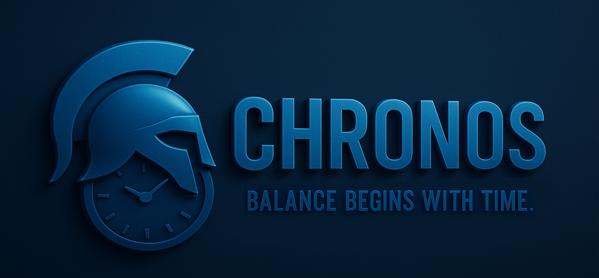

# Chronos Screen Time Tracker

<p align="center">
  <a href="https://opensource.org/licenses/MIT">
    
  </a>
  <a href="https://github.com/ghassanelgendy/chronos-screentime/issues">
    
  </a>
  <a href="https://github.com/ghassanelgendy/chronos-screentime/releases/tag/latest">
    
  </a>
</p>



Chronos is a local-first screen time tracker for Windows built with .NET 8 and WPF. It runs in the background to log your active application usage, helping you understand your digital habits with a clean desktop dashboard.

> ⚡ **Looking for something lighter?**
> I ported this application to Rust! If you prefer a minimal background tracker that sits in your system tray, uses negligible resources, and syncs directly to a Supabase backend, check out [Chronos Minimal](https://github.com/ghassanelgendy/chronos-minimal).

---

## Features

- **Real-Time Logging:** Tracks active foreground window usage second-by-second.
- **Detailed Analytics:** View total screen time, session counts, and app switches in a desktop dashboard.
- **Local Storage:** Saved locally in a lightweight JSON file (`%APPDATA%\ChronosScreenTime\screentime_data.json`).
- **Flexible UI:** Minimize to the system tray, toggle "Always on Top", or hide the title bar for a distraction-free view.
- **Privacy First:** Your tracking data never leaves your computer unless you explicitly configure sync features.

---

## Getting Started

### Prerequisites

- **.NET 8.0 SDK** (or runtime to run the executable)
- **Visual Studio 2022** (if building from source, with the **.NET desktop development** workload)

### Installation & Run

1. Clone the repository:
   ```sh
   git clone https://github.com/ghassanelgendy/chronos-screentime.git
   ```
2. Open `chronos-screentime.sln` in Visual Studio.
3. Press `F5` to build and run.

### Building a Standalone Release

To build a single-file executable that runs without requiring a separate .NET installation:

```bash
dotnet publish -c Release -r win-x64 --self-contained true /p:PublishSingleFile=true /p:IncludeNativeLibrariesForSelfExtract=true
```

The executable will be located in `bin/Release/net8.0-windows/win-x64/publish/chronos-screentime.exe`.

---

## How It Works

- **Auto-tracking:** Begins monitoring active window focus as soon as the app starts.
- **Controls:** Pause or resume tracking directly from the footer toggle.
- **Data Management:** Clear all data via the **Reset All** button, or right-click any single app in the list to reset its specific history.

---

## Technical Stack

- **Framework:** .NET 8
- **UI Library:** WPF (Windows Presentation Foundation)
- **Data Serialization:** Newtonsoft.Json

---

## License

Distributed under the MIT License. See `LICENSE` for details.
